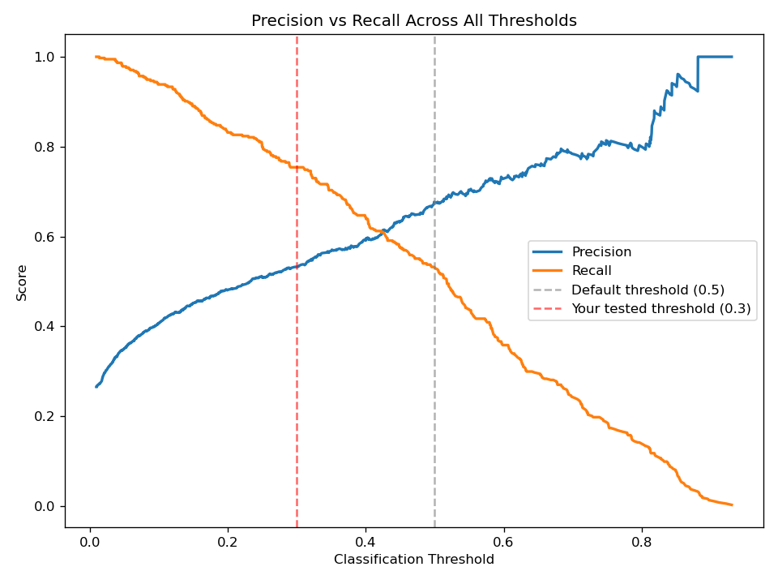

# Customer Churn Prediction Using Gradient Boosting

## Problem Statement

Customer churn is one of the biggest challenges faced by subscription-based businesses. Losing existing customers directly impacts revenue, so identifying customers who are likely to leave allows companies to take proactive retention actions.

The goal of this project is to build a machine learning classification model that predicts whether a customer is likely to churn based on their demographic details, service usage, contract information, and billing history.

---

## Project Workflow

The project follows a complete machine learning workflow:

1. Data Understanding and Exploratory Data Analysis (EDA)
2. Data Cleaning and Feature Engineering
3. Data Preprocessing
4. Model Training
5. Hyperparameter Optimization
6. Model Evaluation
7. Model Saving and Prediction

---

## Data Analysis and Preprocessing

During Exploratory Data Analysis, several issues were identified in the dataset:

### 1. Data Type Correction

The `TotalCharges` column was incorrectly stored as an object data type instead of a numerical type (`int64`/`float64`).

It was converted into a numerical column using:

- `pd.to_numeric()`
- Missing values were handled using median imputation

---

### 2. Target Variable Transformation

The target variable `Churn` contained categorical values: Yes and No

Since this was our prediction target, it could not be processed using OneHot Encoding.

Instead, it was converted using mapping:
Yes → 1
No → 0

---

### 3. Removing Unnecessary Features

The `customerID` column was removed because it only represents unique customer identifiers and does not provide meaningful information for predicting churn.

---

### 4. Feature Engineering

A new feature was created:
TotalSpend = MonthlyCharges × tenure

This represents the total amount spent by a customer during their subscription period and helps the model understand customer value.

---

## Model Development

The data was split into training and testing sets using stratified splitting to maintain the same churn distribution in both datasets.

A preprocessing pipeline was created:

### Numerical Features

- Missing value handling using mean imputation
- Feature scaling using StandardScaler

### Categorical Features

- Missing value handling using most frequent imputation
- Encoding using OneHotEncoder

A complete Scikit-Learn Pipeline was used to ensure preprocessing steps were applied consistently during training and prediction.

---

## Model Used

The final model used was:

### Gradient Boosting Classifier

Hyperparameter tuning was performed using:

- GridSearchCV
- 5-fold Cross Validation
- Recall as the optimization metric

The reason for prioritizing recall was that identifying potential churn customers is more important than only maximizing overall accuracy.

---

## Threshold Optimization

The default classification threshold of 0.5 was adjusted.

A custom threshold of:
0.3

was selected because it significantly improved the recall score.

This allows the model to identify more potential churn customers, reducing the chances of missing customers who may leave.

---

## Results

The model was evaluated on a held-out test set using the default 0.5 classification threshold, then re-evaluated after adjusting the threshold based on business priorities.

| Metric | Default Threshold (0.5) | Adjusted Threshold (0.3) |
|-----------|:---:|:---:|
| Accuracy  | 0.81 | — |
| Precision | 0.68 | 0.53 |
| Recall    | 0.53 | 0.75 |
| F1 Score  | 0.59 | — |

Confusion Matrix (default threshold):

[[940  95]
 [176 198]]

At the default threshold, the model missed 176 actual churners (false negatives) while correctly catching 198. Since a missed churner represents lost revenue with no chance to intervene, while a false positive only costs a low-value retention offer, recall was prioritized over raw accuracy when choosing the final threshold.

Lowering the threshold to 0.3 raised recall from 0.53 to 0.75 — catching 84 more actual churners — at the cost of precision dropping from 0.68 to 0.53 (more false alarms). The full tradeoff across every possible threshold is shown below:

The 0.3 threshold was chosen as a reasonable balance given the asymmetric cost of the two error types. With real business figures for the cost of a missed churner versus a wasted retention offer, this threshold could be optimized further rather than chosen by inspection.

## Limitations

The dataset used for this project has a limited number of features; richer behavioral or usage data (e.g. support ticket history, product engagement) would likely improve recall further.
Class imbalance in the target variable was addressed via threshold adjustment and the recall scoring metric during tuning, but resampling techniques (e.g. SMOTE) were not tested and could be a useful next step.
The 0.3 threshold was selected by inspection of the precision-recall curve rather than from an explicit cost-benefit calculation, since exact business costs for a missed churner vs. a false alarm were not available.

## Model Deployment Preparation

The trained pipeline was saved using:joblib

The saved model can be loaded and used for predicting churn on new customer data.

---

## Technologies Used

- Python
- Pandas
- NumPy
- Scikit-Learn
- Joblib
- Gradient Boosting
- Git/GitHub

---

## Future Improvements

- Build a FastAPI backend for real-time predictions
- Deploy the model using cloud services
- Add monitoring for model performance
- Experiment with advanced models such as XGBoost and LightGBM

---

## Author

Prabhpreet Singh
